# E-connect Teachers App

The E-connect Teachers App is a comprehensive mobile application built using the Flutter framework and integrated with Firebase services. This app aims to streamline and enhance the daily tasks of teachers by providing a platform where they can efficiently manage their schedules, access class information, and communicate seamlessly with other users through a built-in messaging feature.

## Screenshots

<p>
    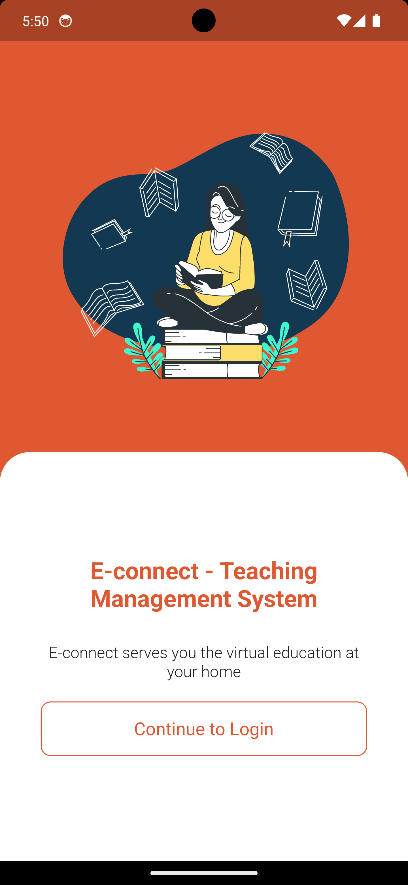
    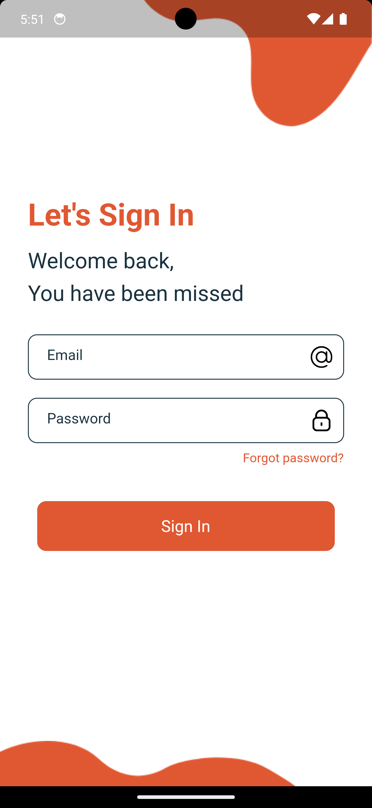
    
    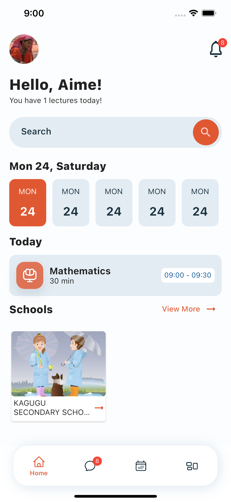
    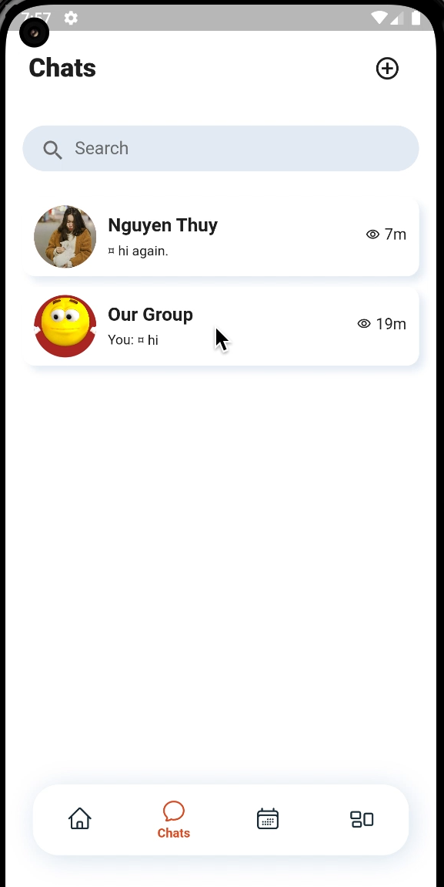
    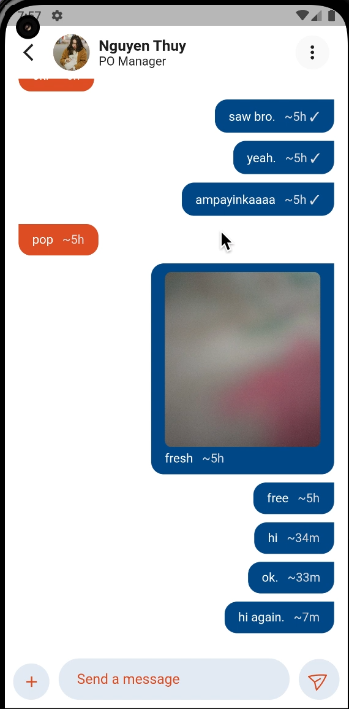
    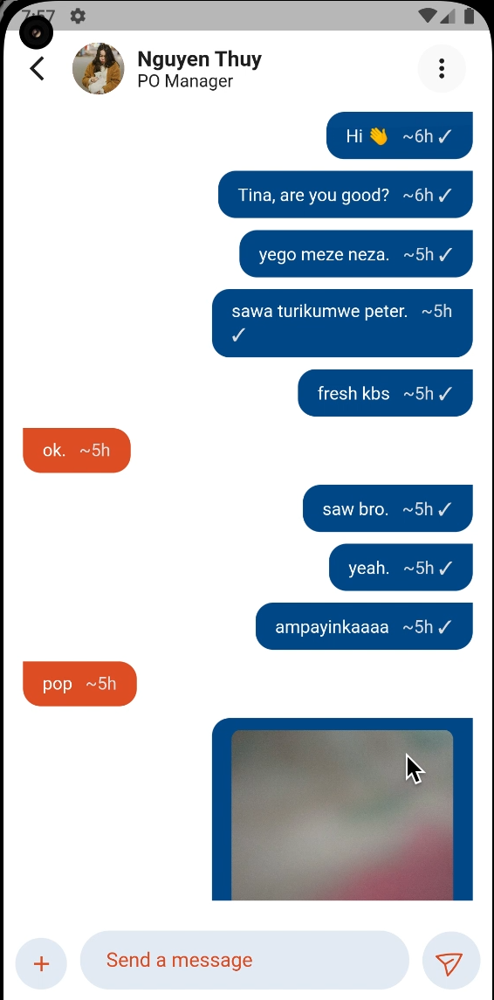
    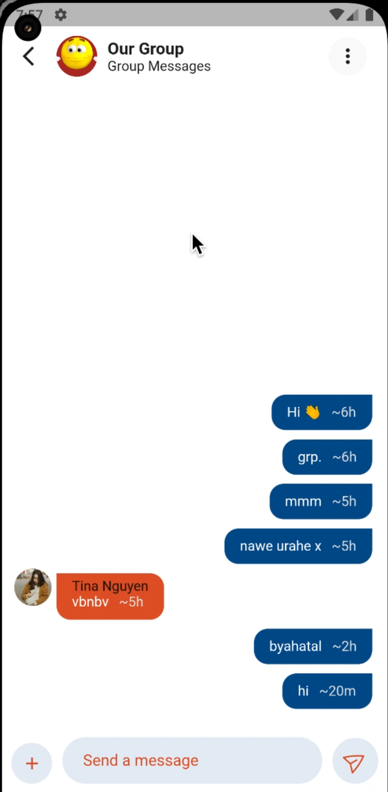
    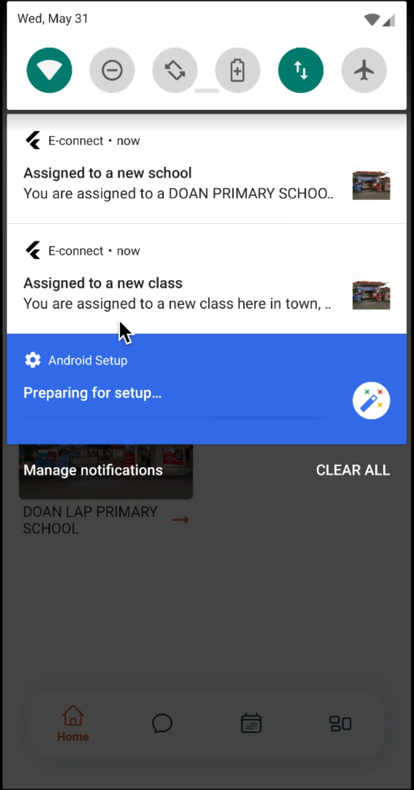
    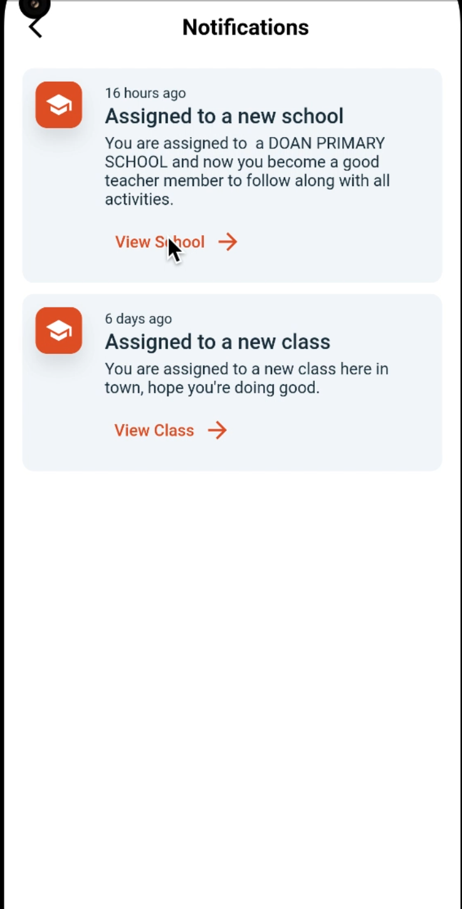
    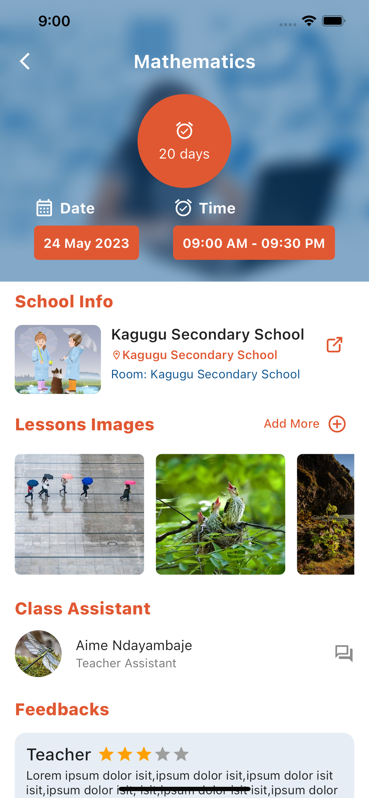
    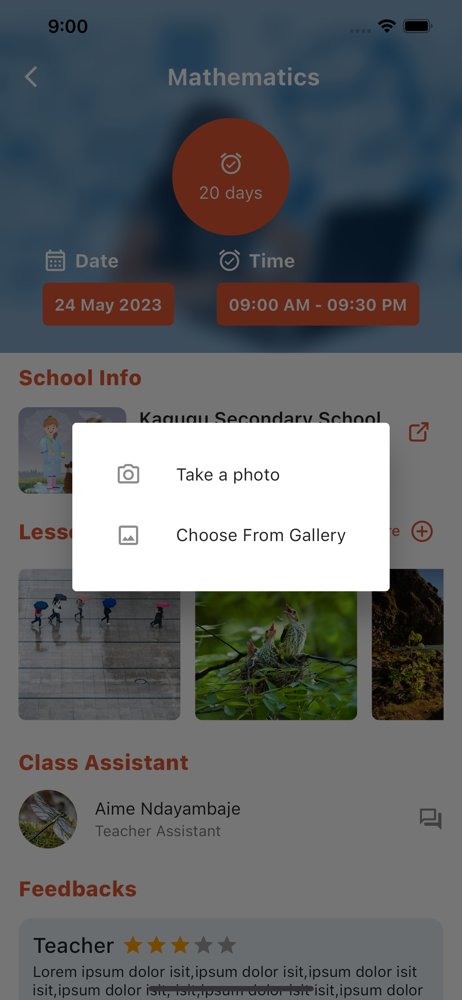
    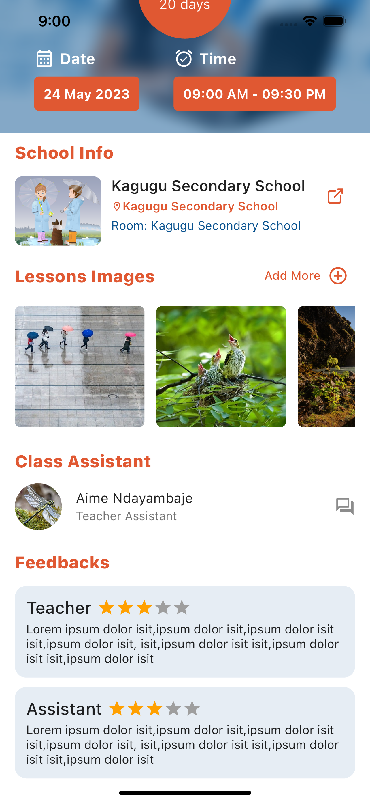
    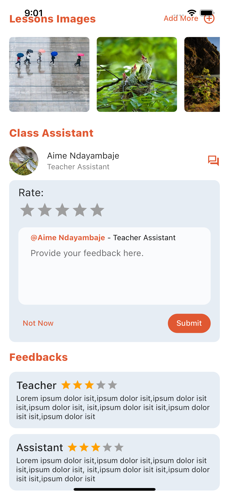
    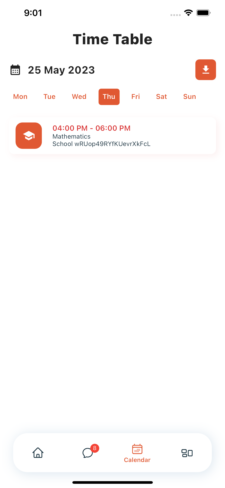
    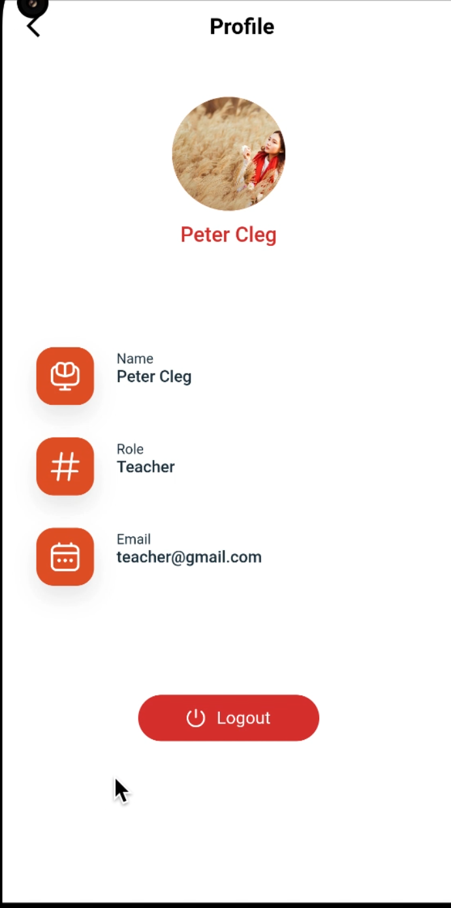
    </p>
## Demo Video
[https://www.youtube.com/watch?v=srCSJmT5jkg](https://www.youtube.com/watch?v=srCSJmT5jkg)
## Features

- **Schedule Management:** Teachers can access their daily and weekly schedules with details about the classes they need to teach and the corresponding locations. The app ensures that educators stay organized and prepared for their classes.

- **Downloadable Schedules:** Teachers can conveniently download their schedules and have them readily available offline. This feature ensures that instructors can access their schedules even without an active internet connection.

- **Chat Messaging:** The app includes a real-time messaging feature that allows teachers, project managers, and school directors to communicate efficiently within the platform. This fosters collaboration, enables quick communication, and facilitates information sharing among all stakeholders in the educational process.
- **Notifications:** The app provides timely notifications using `firebase_messaging` and `awesome_notifications`. Teachers receive alerts about upcoming classes, schedule changes, and new messages, ensuring they stay informed and engaged even when they are not actively using the app.

## Technologies Used

- **Flutter:** The app is developed using the Flutter framework, which enables the creation of cross-platform applications with a single codebase. Flutter's rich set of widgets and libraries ensures a smooth and consistent user experience across iOS and Android devices.

- **Firebase:** Firebase serves as the backend infrastructure for the app. Firebase Authentication is utilized for user authentication, while Firestore provides the real-time database for storing and retrieving schedules and messages. Firebase Cloud Functions can be integrated for serverless functionality.

## Installation

1. Clone the repository:

   ```bash
   git clone https://github.com/aimelive/teaching_app.git
   ```

2. Navigate to the project directory:

   ```bash
   cd teaching_app
   ```

3. Install dependencies using Flutter:

   ```bash
   flutter pub get
   ```

4. Set up Firebase:

   - Create a new Firebase project (if not already done).
   - Add the Firebase configuration files to the app as specified in the [Firebase documentation](https://firebase.flutter.dev/docs/overview).

5. Run the app:
   ```bash
   flutter run
   ```
